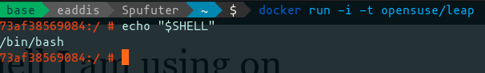

# Docker

Primi rudimenti nel mondo di Docker.

Per una guida teorica su come Docker è composto clicca su questo [link](https://docs.docker.com/get-started/overview/#:~:text=Docker%20uses%20a%20client%2Dserver,to%20a%20remote%20Docker%20daemon.).


### Inizializzare un container

Per inizializzare un contaner partendo da un'immagine preesistente possiamo usare il comando `run` :

```sh
docker run -i -t opensuse/leap
```

In questo caso viene inizializzato un container `opensuse/leap` (versione di OpenSUSE stabile) con gli argomenti:

- `-t`  TTY - Per collegare il nostro terminale ai messaggi da console che vengono emessi dal contaner
  Le immagini Docker dei sistemi operativi sono spesso nella loro versione server e minimale (non abbiamo strumenti di editing come `vi` o `nano`)
- `-i` Interactive mode - Per inizializzare il contaner in modalità interattiva

In questo caso verrà eseguita la shell di default



