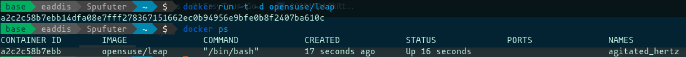
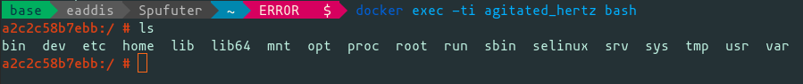
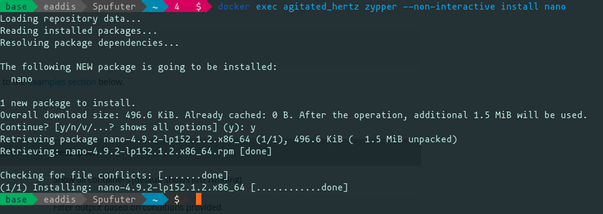
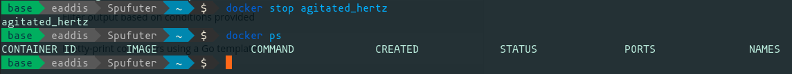

# Docker

Primi rudimenti nel mondo di Docker.

Per una guida teorica su come Docker è composto clicca su questo [link](https://docs.docker.com/get-started/overview/#:~:text=Docker%20uses%20a%20client%2Dserver,to%20a%20remote%20Docker%20daemon.).


### Primi rudimenti

Per inizializzare un contaner partendo da un'immagine preesistente possiamo usare il comando `run` :

```sh
docker run -i -t opensuse/leap
```

In questo caso viene inizializzato un container `opensuse/leap` (versione di OpenSUSE stabile) con gli argomenti:

- `-t`  TTY - Per collegare il nostro terminale ai messaggi da console che vengono emessi dal contaner
  Le immagini Docker dei sistemi operativi sono spesso nella loro versione server e minimale (non abbiamo strumenti di editing come `vi` o `nano`)
- `-i` Interactive mode - Per inizializzare il contaner in modalità interattiva

In questo caso verrà eseguita la shell di default


Possiamo avviare dei container anche in modalità `detatched` ovvero in background senza occupare la shell corrente:

```sh
docker run -t -d opensuse/leap
```

In questo caso abbiamo aggiunto il flag `-d` per indicare che vogliamo eseguire il container in background.

Inoltre abbiamo comunque lasciato il flag `-t` per fare in modo che una volta inizializzato il contaner resti in attesa di un'interazione (in questo caso abbiamo lasciato la shell di SUSE aperta).

Possiamo verificare che il contaner sia in esecuzione con il comando:

```sh
docker ps
```

che ci mostra tutti i contaner inizializzati che sono ancora in esecuzione.



Possiamo ora provare ad eseguire un comando dentro il container, perchè non aprire un'altra sessione della shell!

```sh
docker exec -i -t agitated_hertz bash # Dove -> exec [opzioni] {NOME_CONTAINER} {COMANDO}
```

In questo caso le opzioni `-i` e `-t` sono necessarie se vogliamo aprire bash per poter scrivere un comando.

L'argomento `agitated_hertz` corrisponde ad un nome assegnato al container automaticamente da Docker (dall'output di `docker ps`).



Non siamo costretti ad utilizzare sempre `-i` o `-t` possiamo anche eseguire comandi che non richiedono la modalità interattiva,

come per esempio `zypper --non-interactive install nano` - l'installazione di un pacchetto:



Per fermare un container che viene eseguito in modalità background:

```sh
docker stop {NOME_CONTAINER}
```

